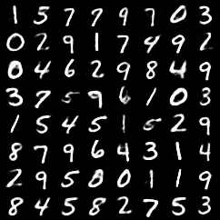
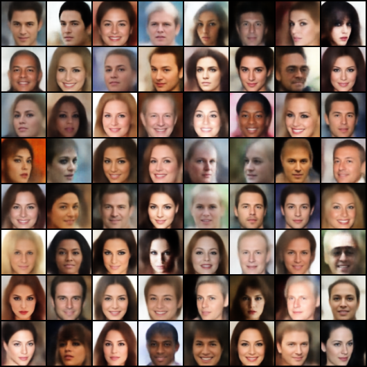

# Optimal Transport Based Generative Autoencoders

This is the official pytorch implementation of AE-OTgen and AE-OTtrans. The 
paper is here: [Waiting for verification on ArXiv]

### Dependencies

```
python 3.6.7
pytorch 1.0.1.post2
matplotlib 3.0.3
POT (python optimal transport) 0.5.1
```

Cuda is required for this to run on your machine.

### Usage

1. Download CelebA.
Download ```img_align_celeba.zip``` and extract it under a folder titled 
```celebA```.

2. Run the program.
Run ```python3 main.py -h``` for a list of arguments and then follow them.

### Results
Results will be stored within whatever folder you specify with the --Folder 
flag. Here are some example generated images using AE-OTgen.

#### MNIST


#### CelebA


### TODO:
1. Stop using keras for mnist/fashion_mnist downloading lol (DONE)
2. Get arxiv link lol
3. Make a results folder to house all my results from the paper (DONE)
4. Better Usage in README.md
